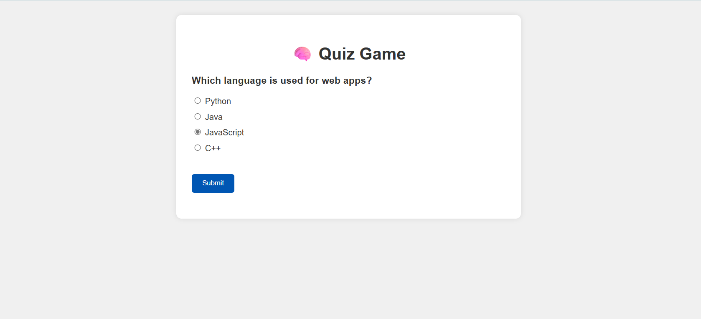
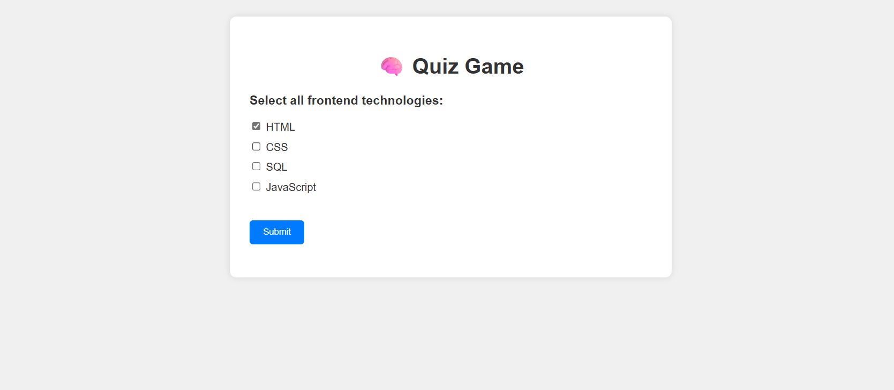
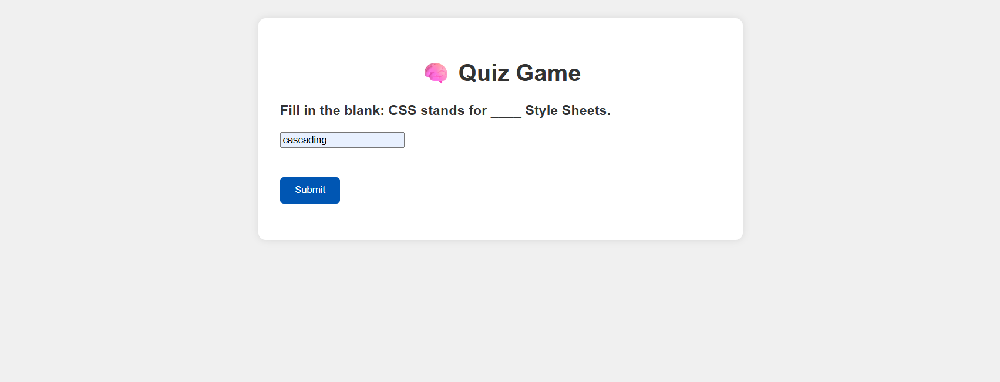
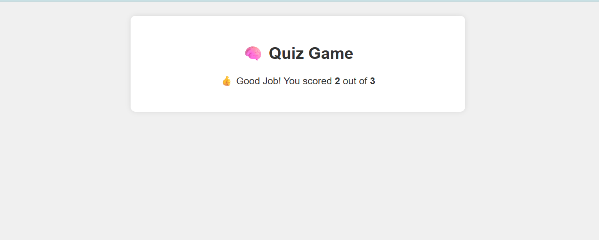

# 🧠 Quiz Game Web Application

This is an interactive and beginner-friendly **Quiz Game** built using **HTML, CSS, and JavaScript**.  
It supports multiple types of questions and provides dynamic feedback based on your final score.

---

## 🚀 Features

- ✅ Single choice (radio buttons)
- ✅ Multi-select (checkboxes)
- ✅ Fill-in-the-blank (text input)
- 📊 Real-time scoring
- 🎯 Custom result messages: *Perfect Score*, *Good Job*, or *Better Luck Next Time*
- 📱 Mobile-responsive design

---

## 🧰 Tech Stack

- **HTML5** – For page structure
- **CSS3** – For clean, responsive design
- **JavaScript (Vanilla)** – For quiz logic and interactivity

---

## 📸 Preview

  




---

## 🛠️ How It Works

- Questions are stored in a `quizData` array.
- Each question has a `type`: `single`, `multi`, or `fill`.
- User input is captured and checked against the correct answer(s).
- Score is updated in real-time.
- Final result message changes based on your performance:
  - 🎉 Perfect Score!
  - 👍 Good Job!
  - 😞 Better Luck Next Time!

---

## 📂 File Structure

```bash
/Quiz_Game
|-- index.html
|-- style.css
|-- script.js
|-- /screenshots
|   |-- quiz_preview_1.png
|   |-- quiz_preview_2.png
|   |-- quiz_preview_3.png
|   |-- quiz_preview_4.png

````


---

## 🌐 Live Demo

> You can deploy this on GitHub Pages and update this section with your live link.  
> Example: [**View Live**](https://yourusername.github.io/quiz-game)

---

## 🙋‍♀️ Author

**Pavani Abothula**  
🎓 B.Tech CSE Student | Frontend Intern at SkillCraft Technologies  
🔗 [LinkedIn](https://www.linkedin.com/in/pavani-abothula)  
💻 [GitHub](https://github.com/codingWithPavani)

---

## 📄 License

This project is **open-source** and free to use under the [MIT License](LICENSE).
